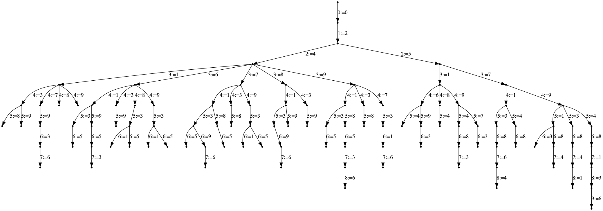
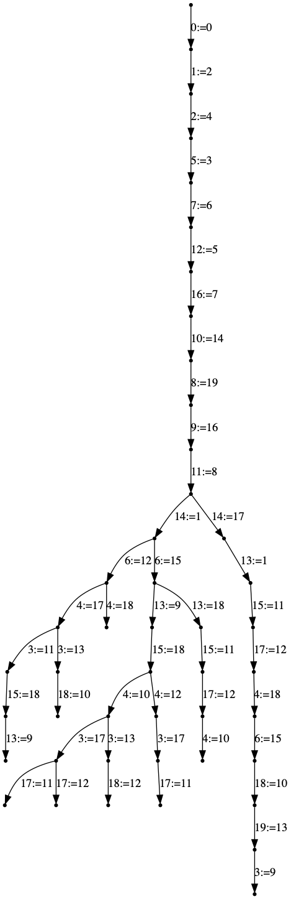

# Content

We provide a tiny constraint programming solver. Its aim is to illustrate the basic techniques, but is not bullet proof or highly efficient.

# The constraint programming paradigm

A problem is specified by some variables, each variable has a name and a domain.
The goal is to assign every variable to some value from its domain so to satisfy given constraints.

We only allow two type of constraints. Unary constraints, which apply on a single variable. (They just reduce the domain to the valid values.)  And binary constraints which apply to a pair of variables.  The constraint is either defined by a boolean function on value pairs or on a set of value pairs, defining the enforced relation between the variables.

The solver solves the given constraint program by backtracking, and returns either `None` if no solution has been found or a solution in form of a dictionnary associating to each variable a value.

# The API

We provide the class `ConstraintProgram`. Its constructor takes as argument a dictionnary, mapping variables to domains. A variable can be any hashable object.  Domains should be sets.  The method `add_constraint(x, y, rel)`, adds a constraint on the variables x and y. It enforces that x and y are assigned to values u and v respectively such that (u,v) satisfies the given relation.  The method `solve()` tries to find a solution by backtracking, returns `None` in case of failure and a dictionnary variables-values in case of success.  

# The principle

The algorithm performs a depth first exploration of a search tree. Every node corresponds to partial assigment of variables to values, satisfying every constraint involving assigned variables.  Then a branching variable is choosen. A usual simple choice is the variable x with the smallest domain, as this is likely to produce a small subtree.  Then the search loops over all values u from the domain of x, and tries to assign x:=u, each alternative leading to a different search subtree.

There are three main possibilities to maintain consistency among the assigned variables.

## Backward check

When trying to assign x:=u, we verify for every already assigned variable y, if this will not violate some constraint.

##  Forward check

When trying to assign x:=u, we consider every free (not yet assigned) variable y which has a constraint with x. And we reduce the domain of y to those values which satisfy the constraint, given that x has the value u.
Here we need to be carefull. When backtracking, the domains must be restored, so we need a context saving mechanism.

##  Arc consistency

We can push the previous mechanism a step further. Once some value v has been removed from variable y, maybe there is a related variable y', which has a value v' in its domain, which is not compatible anymore with any of the values in the domain of y. In that case, we say that the assignment y':=v' has no support in the domain of y.  In this case it would be safe to remove v' from the domain of y' as well.   Maintaining arc consistency does exactly these operations.

There are different methods to ensure arc consistency, we implemented the procedure [AC3](https://en.wikipedia.org/wiki/AC-3_algorithm).  Experiments with the procedure AC4 have been done by us, and it seems that even though the theoretical worst case complexity of this procedure is better, it is difficult to implement it efficiently so to beat AC3 in practice.

# Dumping the exploration tree

The file `dump_tree` provides a class which permits to print into a DOT file the explored recursion tree. For this purpose, call the constructor of `ConstraintProgram` with a filename as the second parameter.

For illustration, we show the exploration trees using the 3 different above mentioned techniques, on the example of the [n-queen](https://en.wikipedia.org/wiki/Eight_queens_puzzle) problem.  We model it with n variables, describing for every row number the column number of the queen in the row.

{:width="600"}

{:width="600"}

{:width="600"}

# Examples

This constraint programming solver is illustrated with a few examples, the n-queen problem, Sudoku, Eternity, and the [Zebra puzzle](https://en.wikipedia.org/wiki/Zebra_Puzzle).
